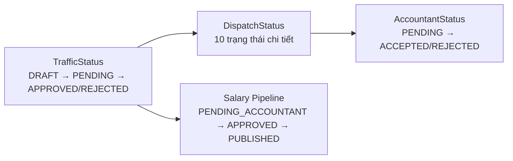
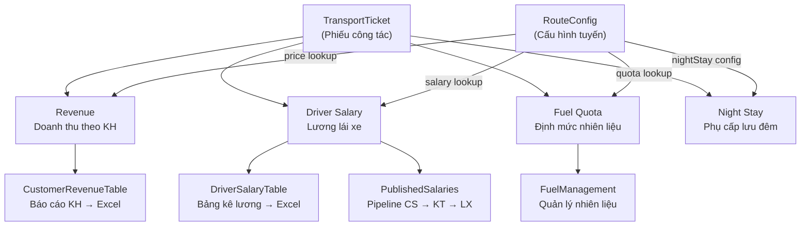

# Đánh Giá Mức Độ Đáp Ứng 4 Yêu Cầu Nghiệp Vụ — Hệ Thống Danalog

> **Ngày đánh giá:** 12/04/2026  
> **Phạm vi:** Toàn bộ codebase `danalog-platform` (frontend + server) và `driver-app`

---

## Tổng Quan Nhanh

| # | Yêu cầu | Mức đáp ứng | Đánh giá |
|---|---------|:-----------:|----------|
| 1 | Nền tảng thống nhất, tập trung dữ liệu | ✅ **95%** | Đã đáp ứng tốt |
| 2 | Trạng thái nghiệp vụ + phân quyền + truy vết | ✅ **90%** | Đã đáp ứng, còn một số gap nhỏ |
| 3 | Công cụ ra quyết định dựa trên dữ liệu | ✅ **85%** | Đã có AI Suggest, cần mở rộng |
| 4 | Liên kết dữ liệu vận tải ↔ doanh thu/lương/nhiên liệu/báo cáo | ✅ **90%** | Đã liên kết end-to-end |

---

## 1. Nền Tảng Thống Nhất — Tập Trung Dữ Liệu ✅ 95%

### Đã có

| Khả năng | Bằng chứng trong code |
|----------|----------------------|
| **Single Platform cho toàn bộ luồng phiếu công tác** | Một ứng dụng web duy nhất (`danalog-platform`) + một driver mobile app (`driver-app`), kết nối cùng Supabase backend |
| **Tập trung dữ liệu trên 1 DB** | Supabase tables: `Tickets`, `Orders`, `RouteConfigs`, `Users`, `DispatchLogs`, `Notifications`, `FuelTickets`, `PublishedSalaries`, `TicketCorrections`, `ProfileUpdateRequests` — [api.ts](file:///d:/Downloads/123456%20-%20Copy/danalog-platform/frontend/src/services/api.ts) |
| **Luồng xử lý end-to-end trên 1 hệ thống** | Order → Ticket Generation → Dispatch → Driver Response → CS Review → Accountant Approval → Payroll — tất cả trong cùng 1 platform |
| **Driver App tích hợp** | App riêng cho lái xe nộp chứng từ, phản hồi điều phối, xem lương — dữ liệu đồng bộ realtime về platform chính |
| **Notification system xuyên suốt** | Hệ thống thông báo đa vai trò (role-based + user-specific) qua Supabase `Notifications` table — [NotificationDropdown.tsx](file:///d:/Downloads/123456%20-%20Copy/danalog-platform/frontend/src/components/NotificationDropdown.tsx) |

### Gap còn lại

> [!NOTE]
> - **Chưa có real-time sync** (WebSocket/SSE): hiện dùng polling khi window focus (`SWR-style`). Nếu nhiều người dùng đồng thời, có thể miss updates.
> - **Blockchain hash** (`onChainHash`, `onChainStatus`) đã có field nhưng chưa thực sự tích hợp — hiện chỉ là placeholder.

---

## 2. Trạng Thái Nghiệp Vụ + Phân Quyền + Truy Vết ✅ 90%

### 2.1 Trạng thái nghiệp vụ rõ ràng

Hệ thống có **3 lớp trạng thái** hoạt động song song:

| Trạng thái | Giá trị | Vị trí |
|-----------|---------|--------|
| **Ticket Status** (CS Review) | `DRAFT`, `PENDING`, `APPROVED`, `REJECTED` | [types.ts:L252](file:///d:/Downloads/123456%20-%20Copy/danalog-platform/frontend/src/types.ts#L252) |
| **Dispatch Status** (Điều vận) | `WAITING_DISPATCH`, `RECOMMENDED`, `ASSIGNED`, `DRIVER_PENDING`, `DRIVER_ACCEPTED`, `DRIVER_REJECTED`, `NO_CANDIDATE`, `ESCALATED`, `IN_PROGRESS`, `COMPLETED` | [types.ts:L168-L178](file:///d:/Downloads/123456%20-%20Copy/danalog-platform/frontend/src/types.ts#L168-L178) |
| **Accountant Status** | `PENDING`, `ACCEPTED`, `REJECTED` | [types.ts:L308](file:///d:/Downloads/123456%20-%20Copy/danalog-platform/frontend/src/types.ts#L308) |
| **Salary Status** | `PENDING_ACCOUNTANT`, `APPROVED_ACCOUNTANT`, `REJECTED_ACCOUNTANT`, `PUBLISHED` | [App.tsx:L376-L381](file:///d:/Downloads/123456%20-%20Copy/danalog-platform/frontend/src/App.tsx#L376-L381) |
| **Correction Request** | `PENDING`, `APPROVED`, `REJECTED` | [types.ts:L1537](file:///d:/Downloads/123456%20-%20Copy/danalog-platform/frontend/src/types.ts#L1537) |

### 2.2 Phân quyền theo vai trò

7 vai trò được định nghĩa với phân quyền rõ ràng:

| Vai trò | Quyền chính | Code reference |
|---------|-------------|----------------|
| `ADMIN` | Toàn quyền: Dashboard, quản lý user, route config, xem tất cả | [App.tsx:L130](file:///d:/Downloads/123456%20-%20Copy/danalog-platform/frontend/src/App.tsx#L130) |
| `CS` | Tạo đơn, kiểm tra phiếu, gửi lương cho Kế toán | [App.tsx:L135](file:///d:/Downloads/123456%20-%20Copy/danalog-platform/frontend/src/App.tsx#L135), canViewCS |
| `CS_LEAD` | Duyệt yêu cầu sửa đổi phiếu, giám sát CS | CSLeadSchedule |
| `DISPATCHER` | Điều phối xe, xem bảng điều vận (giới hạn field tài chính) | canViewDispatch |
| `DV_LEAD` | Quản lý điều phối, escalation, xem dashboard performance | DispatchLeadSchedule |
| `ACCOUNTANT` | Duyệt/từ chối bảng lương, đối soát phiếu | [App.tsx:L131](file:///d:/Downloads/123456%20-%20Copy/danalog-platform/frontend/src/App.tsx#L131) |
| `DRIVER` | Nhận lệnh, nộp chứng từ, xem lương cá nhân, xin nhiên liệu | MobileDriverDashboard |

**Giới hạn field theo vai trò** đã được implement trong `TicketModal.tsx` — Dispatcher không thấy field tài chính, Driver chỉ thấy field vận hành.

### 2.3 Cơ chế truy vết thao tác

| Cơ chế | Chi tiết | Vị trí |
|--------|----------|--------|
| **`statusHistory`** trên mỗi ticket | Mỗi thao tác (tạo, duyệt, sửa, từ chối) đều ghi lại `{status, timestamp, user, action}` | [types.ts:L300-L305](file:///d:/Downloads/123456%20-%20Copy/danalog-platform/frontend/src/types.ts#L300-L305) |
| **History Modal** | UI hiển thị timeline thao tác dạng vertical timeline | [HistoryModal.tsx](file:///d:/Downloads/123456%20-%20Copy/danalog-platform/frontend/src/components/HistoryModal.tsx) |
| **DispatchLog** | Log chi tiết mỗi lần phân công: ai gợi ý, ai chọn, override hay auto, lý do | [types.ts:L123-L139](file:///d:/Downloads/123456%20-%20Copy/danalog-platform/frontend/src/types.ts#L123-L139) |
| **DriverResponse** | Tracking phản hồi lái xe: thời gian gửi, thời gian phản hồi, lý do từ chối | [types.ts:L152-L165](file:///d:/Downloads/123456%20-%20Copy/danalog-platform/frontend/src/types.ts#L152-L165) |
| **TicketCorrection history** | Ai yêu cầu sửa, ai duyệt, ghi chú review | [types.ts:L1526-L1541](file:///d:/Downloads/123456%20-%20Copy/danalog-platform/frontend/src/types.ts#L1526-L1541) |
| **Notification history** | Tất cả thông báo lưu trong DB, có timestamp + relatedId | [api.ts:L272-L276](file:///d:/Downloads/123456%20-%20Copy/danalog-platform/frontend/src/services/api.ts#L272-L276) |

### Gap còn lại

> [!WARNING]
> - **`statusHistory` được ghi ở frontend**: Logic ghi lịch sử nằm trong component (TicketList.tsx, CreateTicketMobile.tsx) chứ không phải server-side. Nếu user bypass frontend, lịch sử có thể bị mất hoặc giả mạo.
> - **Chưa có audit log tổng hợp** tách biệt khỏi ticket data — statusHistory nằm embedded trong ticket record, khó query/báo cáo cross-ticket.
> - **Chưa log IP/device** khi thao tác.

---

## 3. Công Cụ Ra Quyết Định Dựa Trên Dữ Liệu ✅ 85%

### Đã có

| Tính năng | Chi tiết | Vị trí |
|-----------|----------|--------|
| **AI Driver Suggestion Engine** | Scoring 5 tiêu chí: Continuity (40%), Availability (25%), Route Experience (15%), Performance (10%), Load Balance (10%) | [types.ts:L56-L62](file:///d:/Downloads/123456%20-%20Copy/danalog-platform/frontend/src/types.ts#L56-L62) |
| **Priority Engine** | Tính ưu tiên phiếu: Pickup Urgency (70%) + Waiting Pressure (30%) → 4 mức Critical/High/Medium/Low | [types.ts:L48-L53](file:///d:/Downloads/123456%20-%20Copy/danalog-platform/frontend/src/types.ts#L48-L53) |
| **Dispatch Queue** | Hàng đợi điều phối, sắp xếp theo priority score, hiển thị thời gian còn lại | [types.ts:L231-L250](file:///d:/Downloads/123456%20-%20Copy/danalog-platform/frontend/src/types.ts#L231-L250) |
| **Candidate Ranking** | Hiển thị danh sách ứng viên với breakdown score, continuity badge, recent trips | [DispatchBoard.tsx](file:///d:/Downloads/123456%20-%20Copy/danalog-platform/frontend/src/components/DispatchBoard.tsx) |
| **Rejected Candidate Tracking** | Hiển thị lý do loại ứng viên: xe bận, lái không available, overlap, size mismatch... | [types.ts:L106-L121](file:///d:/Downloads/123456%20-%20Copy/danalog-platform/frontend/src/types.ts#L106-L121) |
| **Override Tracking** | Khi override gợi ý AI, phải ghi lý do: lái xe yêu cầu, khách yêu cầu, vận hành, lỗi hệ thống | [types.ts:L86-L93](file:///d:/Downloads/123456%20-%20Copy/danalog-platform/frontend/src/types.ts#L86-L93) |
| **Configurable Weights** | Admin có thể điều chỉnh trọng số scoring | [DispatchConfig](file:///d:/Downloads/123456%20-%20Copy/danalog-platform/frontend/src/types.ts#L141-L147) |
| **SLA Config** | Cấu hình thời gian phản hồi, escalation tự động | [server.js:L112-L119](file:///d:/Downloads/123456%20-%20Copy/danalog-platform/frontend/server.js#L112-L119) |
| **Dashboard Analytics** | DashboardStats tracking: rejection rate, auto-assign rate, AI suggested rate, override rate, escalation rate, continuity usage rate | [types.ts:L215-L229](file:///d:/Downloads/123456%20-%20Copy/danalog-platform/frontend/src/types.ts#L215-L229) |
| **Schedule Dashboards** | 5 dashboard theo vai trò (Admin, DV Lead, Dispatcher, CS Lead, CS Staff) — calendar view tích hợp | [ScheduleDashboards/](file:///d:/Downloads/123456%20-%20Copy/danalog-platform/frontend/src/components/ScheduleDashboards) |
| **Slow Response Alert** | Auto-detect lái xe chưa phản hồi >30 phút, hiển thị alert cho Dispatcher/DV Lead | [App.tsx:L167-L199](file:///d:/Downloads/123456%20-%20Copy/danalog-platform/frontend/src/App.tsx#L167-L199) |

### Gap còn lại

> [!TIP]
> - **Performance score** đang default = 50 (Phase 1) — chưa tính từ dữ liệu thực (tỷ lệ từ chối, đúng giờ, phản hồi nhanh...).
> - **Chưa có predictive analytics**: ví dụ dự báo nhu cầu xe theo lịch sử, cảnh báo tuyến đường quá tải.
> - **Route history** mock (`getRouteHistory` returns `[]`) — không có dữ liệu lịch sử thay đổi cấu hình tuyến đường.

---

## 4. Liên Kết Dữ Liệu Vận Tải ↔ Doanh Thu/Lương/Nhiên Liệu/Báo Cáo ✅ 90%

### Đã có — "Phiếu công tác là trung tâm dữ liệu"

| Liên kết | Cách hoạt động | Vị trí |
|----------|----------------|--------|
| **Ticket → Revenue** | Mỗi ticket có `revenue` được tính tự động từ RouteConfig (size + F/E → price lookup) | [App.tsx:L505-L531](file:///d:/Downloads/123456%20-%20Copy/danalog-platform/frontend/src/App.tsx#L505-L531) |
| **Ticket → Salary** | `driverSalary` trên ticket = snapshot từ RouteConfig; salary table tổng hợp theo lái xe + tháng | [DriverSalaryTable.tsx](file:///d:/Downloads/123456%20-%20Copy/danalog-platform/frontend/src/components/DriverSalaryTable.tsx) |
| **Ticket → Night Stay** | `nightStay`, `nightStayDays`, `nightStayLocation`, `nightStaySalary` — tính vào lương add-on | [DriverSalaryTable.tsx:L148-L191](file:///d:/Downloads/123456%20-%20Copy/danalog-platform/frontend/src/components/DriverSalaryTable.tsx#L148-L191) |
| **Ticket → Fuel** | RouteConfig chứa `fuel.quota` (lít định mức); FuelTickets tracking tạm ứng nhiên liệu thực tế | [FuelManagement.tsx](file:///d:/Downloads/123456%20-%20Copy/danalog-platform/frontend/src/components/FuelManagement.tsx) |
| **Route Config cascade** | Khi cập nhật giá route, hệ thống tự động cập nhật revenue + salary trên **tất cả** ticket liên quan | [App.tsx:L474-L543](file:///d:/Downloads/123456%20-%20Copy/danalog-platform/frontend/src/App.tsx#L474-L543) |
| **Time-travel pricing** | Salary table lookup giá theo `effectiveDate` — đảm bảo đúng giá tại thời điểm chạy | [DriverSalaryTable.tsx:L107-L130](file:///d:/Downloads/123456%20-%20Copy/danalog-platform/frontend/src/components/DriverSalaryTable.tsx#L107-L130) |
| **Excel Export — Salary** | Xuất bảng kê lương đúng format doanh nghiệp (Times New Roman, merge cells, styled) | [DriverSalaryTable.tsx:L232-L421](file:///d:/Downloads/123456%20-%20Copy/danalog-platform/frontend/src/components/DriverSalaryTable.tsx#L232-L421) |
| **Excel Export — Revenue** | Xuất bảng doanh thu KH đúng format (theo KH, theo tháng, đầy đủ phí phụ thu) | [CustomerRevenueTable.tsx:L78-L334](file:///d:/Downloads/123456%20-%20Copy/danalog-platform/frontend/src/components/CustomerRevenueTable.tsx#L78-L334) |
| **Payroll Pipeline** | CS tạo → Gửi KT → KT Duyệt/Từ chối → Công bố cho Lái xe. Hỗ trợ bulk action. | [App.tsx:L376-L472](file:///d:/Downloads/123456%20-%20Copy/danalog-platform/frontend/src/App.tsx#L376-L472) |

### Gap còn lại

> [!IMPORTANT]
> - **Nhiên liệu chưa liên kết trực tiếp với ticket**: `FuelTickets` là bản ghi tạm ứng riêng, chưa auto-link với transport ticket qua `routeId` hoặc `ticketId` để so sánh quota vs actual.
> - **Chưa có P&L report tự động**: Doanh thu - Lương - Nhiên liệu = Lợi nhuận per ticket/route/tháng — dữ liệu đều có nhưng chưa có dashboard tổng hợp lợi nhuận.
> - **`pendingChanges` trên RouteConfig** có logic nhưng `applyPendingChanges()` chỉ là stub (`return Promise.resolve(true)`) — chưa hoàn thiện auto-apply theo effectiveDate.

---

## Kết Luận

Hệ thống Danalog **đã đáp ứng bản chất của cả 4 yêu cầu** ở mức production-ready cho nghiệp vụ hiện tại:

1. ✅ **Nền tảng thống nhất**: Một platform duy nhất, 1 database, driver app tích hợp
2. ✅ **Trạng thái + phân quyền + truy vết**: 7 vai trò, 4 lớp status, statusHistory trên mỗi phiếu
3. ✅ **Công cụ ra quyết định**: AI Driver Suggestion Engine 5 tiêu chí, Priority Engine, SLA alerts
4. ✅ **Liên kết dữ liệu**: Ticket → Revenue/Salary/Fuel/NightStay, cascade pricing, payroll pipeline CS→KT→LX

**Các gap chủ yếu mang tính tối ưu hóa** (real-time sync, server-side audit log, P&L dashboard, fuel-ticket linking) chứ không phải thiếu hụt chức năng cốt lõi.
